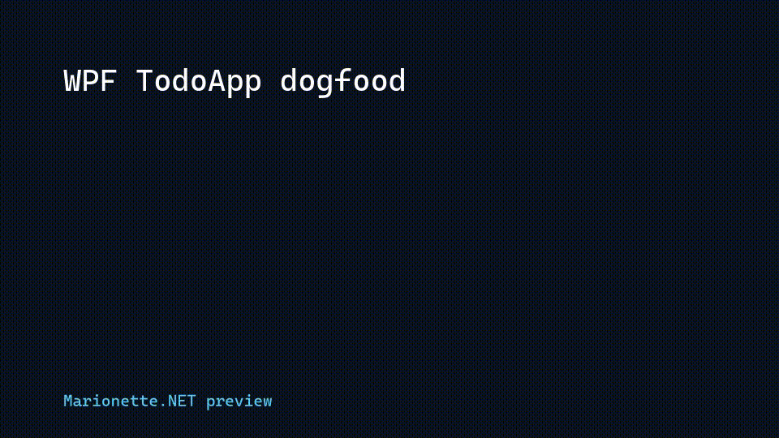
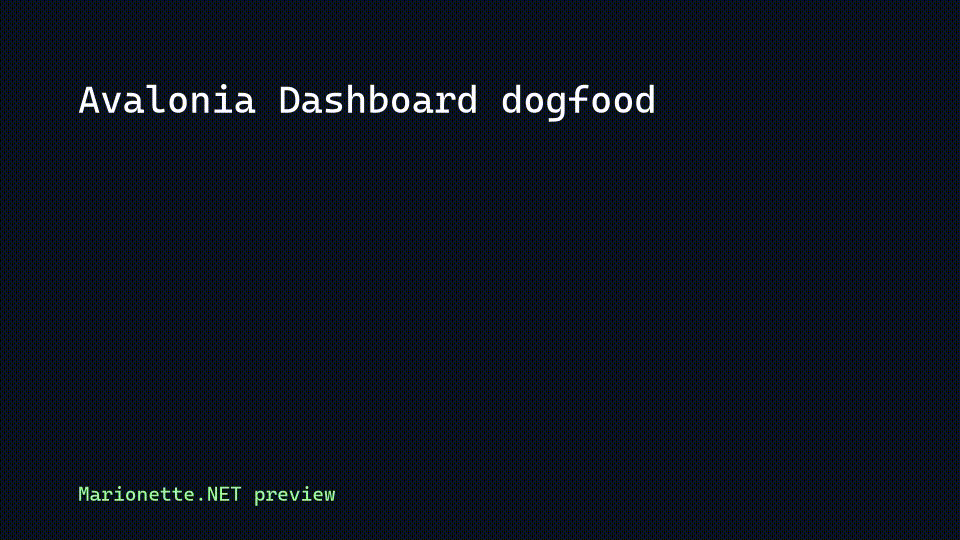
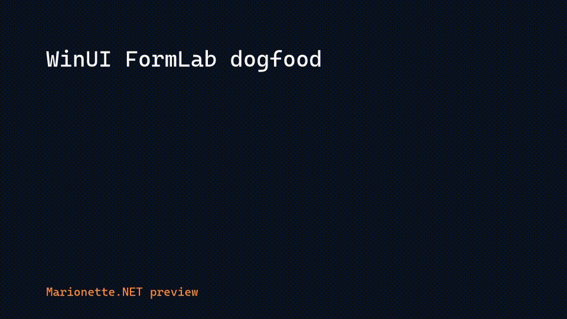

# Marionette.NET

> AI-controllable, AI-testable, AI-observable C# desktop apps. Drop a NuGet, decorate with attributes, ship.

Marionette.NET turns any C# desktop application into an MCP server that Claude (or any MCP-aware agent) can drive end-to-end. **In-process**, **attribute-driven**, **cross-framework** (WPF + Avalonia + WinUI 3 + MAUI today; Uno on the roadmap), **AOT-friendly**, and **strippable to literal zero footprint** in production builds.

```csharp
[McpRoot]
public class TodoListViewModel : INotifyPropertyChanged
{
    [McpCallable("Add a new TODO with the given title.")]
    public void AddTodo(string title) { ... }

    [McpObservable("Total number of todos.", Watchable = true)]
    public int TotalCount => _items.Count;
}
```

```
Sample.Wpf.TodoApp.exe --mcp --headless
```

Claude can now call `TodoListViewModel.AddTodo({"title": "buy milk"})` directly as an MCP tool, subscribe to `marionette://TodoListViewModel/TotalCount`, and screenshot the live window.

## Demos







## What it does

- **Four MCP meta-tools out of the box:** `inspect_app_api`, `invoke_method`, `read_observable`, `capture_screenshot`.
- **Per-method dynamic tools:** every `[McpCallable]` shows up in `tools/list` as `<Root>.<Method>` with a rich JSON input schema, callable directly.
- **`simulate_input` + `raise_event` meta-tools:** real input through each framework's input pipeline (WPF 8-kind matrix via `Mouse.PrimaryDevice` / `Keyboard.PrimaryDevice` + RoutedEventArgs; Avalonia click variants via routed events; WinUI via `AutomationPeer.Invoke()` first, `InputInjector` fallback).
- **Multi-window routing:** when multiple instances of the same `[McpRoot]` are open, each gets a stable `windowId` (`w1`, `w2`, ...) and the runtime registers per-window dynamic-tool variants (`<Root>.<Method>:<windowId>`) alongside the bare-form tool.
- **Idempotent tool identity:** stable SHA-256 over the canonical signature; description-only edits don't churn the tool ID, signature changes do.
- **`tools/list_changed` notifications** when the manifest mutates (hot-plug roots, multi-window open/close — coalesced 100ms).
- **Watchable observables** as MCP resources with `resources/subscribe` push notifications (INPC-driven, polling fallback).
- **`[McpEvent]`** as MCP resources with sequence-numbered event delivery.
- **Channel push** (`Ai.Trigger("...")`) - the app talks back to Claude as JSON-RPC notifications.
- **Loop protection** (`MARIONETTE_MAX_DEPTH`, default 5; decay window via `MARIONETTE_DECAY_SECONDS`).
- **`Marionette.NET.Testing`** in-process test harness: call `inspect_app_api`, `invoke_method`, and `read_observable` directly in unit tests without spawning a stdio MCP process.
- **`Marionette.NET.Testing.Xunit` / `Marionette.NET.Testing.NUnit`** thin adapters for framework-specific test ergonomics and GUI-test gating.
- **DX analyzer hints** (`MAR013`) for public `[McpRoot]` methods that look like possible `[McpCallable]` actions.
- **Compile-time stripping** via `EnableMcpAutomation=false` MSBuild property - Release builds ship with literal zero MCP symbols (IL-verified across WPF, Avalonia, and WinUI samples).

## Status

**Pre-alpha, post-Phase-7 local release candidate.** What works today:

- The four meta-tools, channel push, watchable resources, `[McpEvent]` (Phase 1.2 / 1.6).
- Source generator emits AOT-clean dispatcher tables + per-method JSON schemas; 26/26 generator tests green.
- **Adapter.Wpf** — Dispatcher marshalling, RenderTargetBitmap screenshots, name-resolved control lookup (Phase 1.3).
- **Adapter.Avalonia** — Cross-platform (`net10.0`, NOT `-windows`), Avalonia 11.3.14, Dispatcher.UIThread + RenderTargetBitmap-with-PixelSize semantics (Phase 2.1).
- **Adapter.WinUI** — Windows App SDK / WinUI 3 (`net10.0-windows10.0.19041.0`), unpackaged-first, AutomationPeer-first input strategy (Phase 3.2).
- **Adapter.Maui** - .NET MAUI 10.x Windows head with MAUI dispatcher / handler integration (Phase 4.1).
- **Marionette.NET.Testing** - framework-neutral in-process harness, structured-error assertions, and xUnit/NUnit helper adapters (Phase 6).
- **Local NuGet packaging** - 11 preview packages, including the `Marionette.NET` meta-package, build locally to `artifacts/nuget` (Phase 7).
- **`simulate_input` + `raise_event`** — real input through each framework's input pipeline; WPF 8 kinds, Avalonia click variants, WinUI semantic-first via AutomationPeer (Phase 3.1 / 3.2).
- **Multi-window routing** — per-window dynamic-tool variants (`<Root>.<Method>:<windowId>`), `inspect_app_api` advertises `windowIds` when >1 windows open, `tools/list_changed` coalesced 100ms (Phase 3.3).
- **Sample.Wpf.TodoApp + Sample.Avalonia.Dashboard + Sample.WinUI.FormLab + Sample.Maui.PocketPlanner** - all compatible with the skill-pack v2 workflows.
- 7 end-to-end eval-cases (`dotnet test`) + 3 conditional GUI eval-cases (EC-8 simulate_input, EC-9 raise_event, EC-10 multi-window; gated on `MARIONETTE_GUI_TESTS=1`).
- Local showcase publish + dogfood: WPF TodoApp, Avalonia Dashboard, and WinUI FormLab publish to `artifacts/showcases` and pass headless MCP handshake checks.
- AOT-publish: stripped + full WPF builds both succeed; Avalonia AOT publish + stdio handshake wired in CI.

What is **not** yet here: Uno adapter, public NuGet push, `git push`, GitHub release. Those are deliberately held until manual testing is complete. See [MASTERPLAN.md](MASTERPLAN.md) for the full roadmap.

## Quickstart

```
git clone <this-repo> && cd nw.Automation
dotnet build Marionette.NET.sln -c Debug
pwsh .phase1/demo.ps1
```

The demo script builds the WPF TodoApp, spawns it under `--mcp --headless`, drives the MCP handshake, exercises every Phase-1 tool plus the per-method dynamic tools, and reports PASS/FAIL. Add `-Gui` to also capture a screenshot of the live window.

For the eval-suite that CI runs:

```
dotnet test tests/Marionette.NET.Integration/Marionette.NET.Integration.csproj
```

For the in-process testing toolkit:

```
dotnet test tests/Marionette.NET.Testing.Tests/Marionette.NET.Testing.Tests.csproj
```

For the local release candidate:

```
powershell -NoProfile -ExecutionPolicy Bypass -File .phase7\release-local.ps1
```

## Documentation

- **[MASTERPLAN.md](MASTERPLAN.md)** - Full vision, architecture, roadmap (locked 2026-05-03).
- **[PHASE0_FINDINGS.md](PHASE0_FINDINGS.md)** - Phase 0 spike report (stripping verified, AOT verified, stdio verified).
- **[PHASE1_FINDINGS.md](PHASE1_FINDINGS.md)** - Phase 1 outcomes per masterplan deliverable.
- **[PHASE2_FINDINGS.md](PHASE2_FINDINGS.md)** - Phase 2 outcomes (Avalonia adapter, per-method dynamic tools, idempotent tool identity).
- **[PHASE3_FINDINGS.md](PHASE3_FINDINGS.md)** - Phase 3 outcomes (WinUI adapter, simulate_input + raise_event, multi-window routing).
- **[PHASE6_FINDINGS.md](PHASE6_FINDINGS.md)** - Phase 6 outcomes (testing toolkit, analyzer hint, skill-pack v2, docs).
- **[PHASE7_FINDINGS.md](PHASE7_FINDINGS.md)** - Phase 7 local release-candidate outcomes.
- **[.phase6/6a-testing-toolkit-dx.md](.phase6/6a-testing-toolkit-dx.md)** - Phase 6a testing toolkit slice.
- **[.phase7/7a-distribution-dogfooding.md](.phase7/7a-distribution-dogfooding.md)** - Local package/showcase dogfooding plan.
- **[docs/getting-started.md](docs/getting-started.md)** - Local NuGet consumption and host wiring.
- **[docs/architecture.md](docs/architecture.md)** - Runtime/source-generator/adapter architecture.
- **[docs/adapter-authoring.md](docs/adapter-authoring.md)** - Contract for new UI adapters.
- **[docs/stripping.md](docs/stripping.md)** - Build stripping and AOT verification guide.
- **[docs/testing.md](docs/testing.md)** - In-process test toolkit guide.
- **[docs/winui-input-injection.md](docs/winui-input-injection.md)** - WinUI keyboard / mouse-move injection: when `InputInjector` is available unpackaged-unelevated, fallback paths for constrained systems.
- **[docs/release-local.md](docs/release-local.md)** - Local release runbook without push.
- **[docs/skill-pack.md](docs/skill-pack.md)** - Skill-pack v2 command reference.
- **[skill-pack/README.md](skill-pack/README.md)** - Claude Code skills (manual install today; Phase 7 automates).
- **[skill-pack/prompts/attributes-reference.md](skill-pack/prompts/attributes-reference.md)** - Canonical attribute spec for non-Claude agents.

## License

MIT - see [LICENSE](LICENSE).
